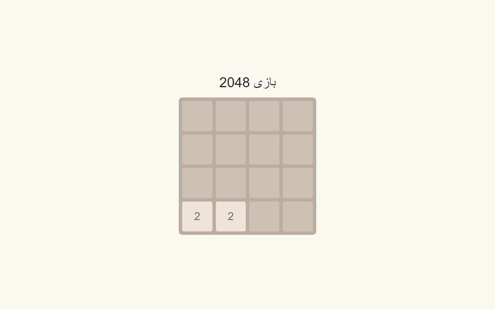

# 2048 Game

🎮 A classic 2048 game built with HTML, CSS, and JavaScript. Combine numbers to reach the 2048 tile!

**[English](#english) | [فارسی](#فارسی)**

---

## English

### Screenshot



### About

A single-file browser implementation of the classic 2048 sliding-tile puzzle — everything (markup, styling, and game logic) lives in `index.html`.

### Tech Stack

- Vanilla HTML, CSS, JavaScript

### Getting Started

Open `index.html` in a browser, or serve the folder statically:

```bash
npx serve .
```

---

## فارسی

### تصویر


### درباره

یک پیاده‌سازی تک‌فایلی از پازل کلاسیک ۲۰۴۸ در مرورگر — همه‌چیز (مارک‌آپ، استایل و منطق بازی) داخل `index.html` قرار دارد.

### پشته فناوری

- HTML، CSS و جاوااسکریپت خالص

### راه‌اندازی

فایل `index.html` را در مرورگر باز کنید، یا پوشه را به‌صورت استاتیک سرو کنید:

```bash
npx serve .
```
